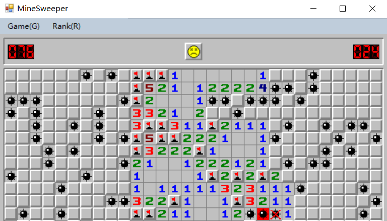

# MineSweeper
A simple copy game of windows minesweeper developped by C# winform.

**See [the rule for mineSweeper](http://www.freeminesweeper.org/help/minehelpinstructions.html)**

In the program, you can
  -  Change the level of game (Beginner, Intermediate, Expert).
  -  View and record your break records.
  -  A installer program to install it on your computer.
  
See below some screenshots in my program:
  

